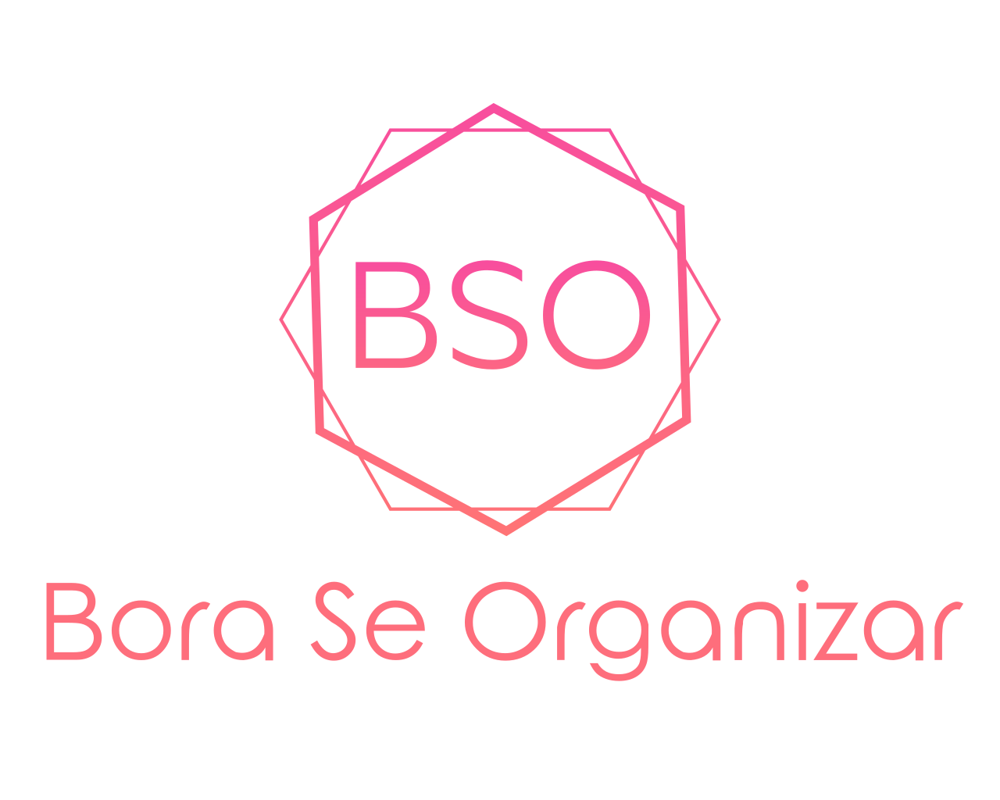

# BSO - BoraSeOrganizar

## Tela Principal
- Lista de todos os projetos que o usuário se encontra.
- Botão de criação de novo projeto.
- Botão para edição de projeto criado por ele.

## Segunda Tela
- Ao abrir um dos projetos ele verá uma lista ordenada pela data de todas as sprints já criadas.
- Botão para cadastrar sprint.
- Botão para ver/editar backlog.
- Gráfico de dados da equipe.
- Lista dos membros da equipe.
- Visualização do burndown.

## Terceira Tela
- Cadastro de Tasks para uma US.
- Visualização do dashboard.

## Quarta Tela
- Lista de colegas.

